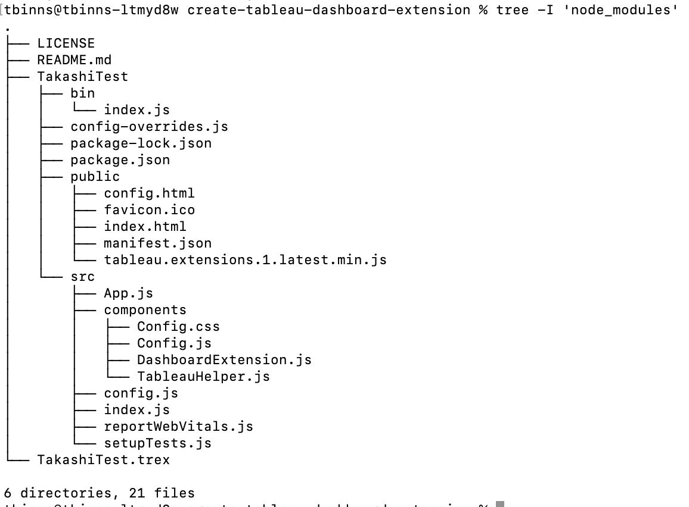

# Create a Tableau Dashboard Extension Starter

This project helps create a basic Tableau dashboard extension.  More information about building dashboard extensions for Tableau can be found [here](https://tableau.github.io/extensions-api/).

## Using the starter tool
To get your first Tableau dashboard extension up and running, execute the command below:

```npx create-tableau-dashboard-extension myExtensionName```

This will create a starter dashboard extension, as well as the trex file needed to run it.  After the build process completes, it will print out the command you need to start the web app.  It should be something like this:

```cd create-tableau-dashboard-extension/{myExtensionName} && npm start```

This will start up the web app, but you still need to open it in Tableau.  Open Tableau Desktop and goto any dashboard.  Drag in a Dashboard Extension object, and navigate to the trex file in your create-tableau-dashboard-extension directory. 

*Note: This tool has a dependency on ```git``` being installed, in order to pull source code for the web app.  If you haven't done so already, please [download and install git](https://git-scm.com/downloads)*

## How does this dashboard extension work?
When you run the npx command, a react web app is created with the following directory structure.  


### Dashboard Extension
The dashboard extension rendering is controlled by src/components/DashboardExtension.js.  It shows a prompt if the extension has not been configured, or  displays some statistics of the selected sheet.  This isn't meant to be useful, more to show how you can detect whether the extension has been configured or not.

### Config popup
The config popup window is controlled by src/components/Config.js.  The contents of the popup are just to show common input types (dropdown menus, sliders, checkboxes, etc).  None of them are actually used, except for the sheet selector dropdown.  The UI components shown are leveraging Tableau's [React UI](https://tableau.github.io/tableau-ui/) to ensure the components look like the rest of Tableau.

### Routing
One thing that may seem unusual about this web app, is that it does not use the standard react-router-dom package.  In order for a dashboard extension to qualify as a "sandboxed extension", it [cannot use standard routing](https://tableau.github.io/extensions-api/docs/trex_sandbox_test.html#requirements-for-sandboxed-extensions). Instead, this project uses the [react-app-rewired](https://www.npmjs.com/package/react-app-rewired) package to allow for multiple entry points (public/index.html & public/config.html)

